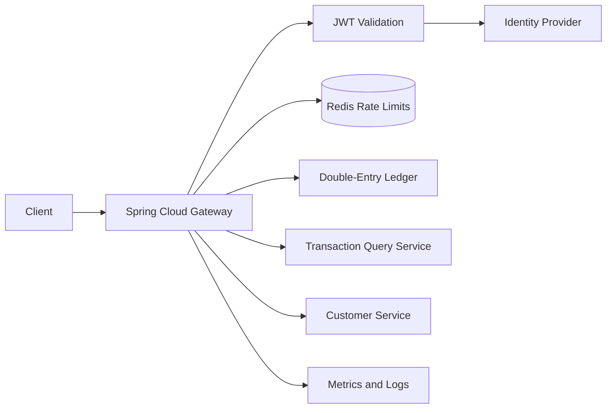
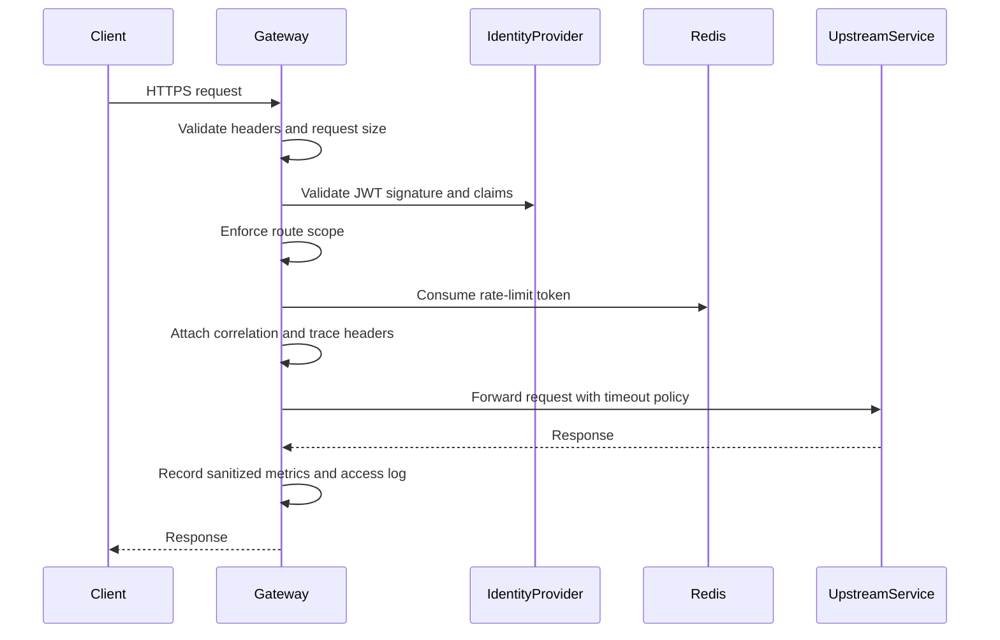

# Java Banking API Gateway

A reactive API gateway for banking-style services, built with Java and Spring Cloud Gateway.

The project focuses on edge security, traffic policy, resilience, auditability, and observability. It is not a replacement for authorization and correctness checks inside downstream services.

## 1. Learning and portfolio goals

Demonstrate:

- Java 21 and reactive Spring
- Spring Cloud Gateway routing and filters
- OAuth2/JWT validation
- Scope- and route-based authorization
- Redis-backed distributed rate limiting
- Timeouts, circuit breakers, and safe retries
- Correlation and trace propagation
- Security-conscious access logging
- Gateway metrics and operational health
- Testing reactive behavior and upstream failures

This project is the Java evolution of the Go API Gateway. Preserve its useful concepts—authentication, Redis rate limiting, circuit breaking, transformations, dynamic routing, analytics, and graceful shutdown—while implementing them through idiomatic Spring components.

## 2. Banking use case

The gateway fronts services such as:

- Double-Entry Ledger
- Transaction Query Service
- Customer Service
- Partner Integration Service

It applies different policies for:

- Customer applications
- Internal operations users
- Trusted service-to-service clients
- External partners

Example:

```text
Customer API:
  OAuth2 access token
  conservative rate limit
  customer scopes

Operations API:
  OAuth2 access token
  privileged scopes
  stronger audit requirements

Partner API:
  OAuth2 client credentials
  partner-specific quota
  optional mTLS in a later phase
```

## 3. Scope

### MVP

- Route requests to multiple backend services
- Validate OAuth2 JWT access tokens
- Enforce route-specific scopes
- Generate or propagate correlation IDs
- Apply distributed Redis rate limits
- Enforce request-size and timeout limits
- Apply per-route circuit breakers
- Retry only explicitly safe requests
- Return consistent gateway error responses
- Forward idempotency keys unchanged
- Emit structured access and security logs
- Expose health, readiness, and Prometheus metrics
- Run locally with mock upstream services and an identity provider

### Later extensions

- Dynamic route configuration
- Partner API keys with hashed storage and rotation
- mTLS for partner and service-to-service traffic
- Token introspection for opaque tokens
- OpenTelemetry trace export
- Web Application Firewall integration
- Canary and weighted routing
- Request signing for high-trust integrations

### Non-goals

- Implementing business authorization owned by downstream services
- Terminating real bank or card-network traffic
- Storing customer credentials
- Logging request or response bodies by default
- Retrying financial mutations merely because they timed out
- Claiming the gateway alone provides zero-trust security

## 4. Architecture



### Request flow



Production validation should use cached signing keys from the issuer's JWKS endpoint rather than a network call to the identity provider on every request.

## 5. Technology baseline

- Java 21
- Maven with Maven Wrapper
- Spring Boot
- Spring Cloud Gateway
- Spring WebFlux
- Spring Security OAuth2 Resource Server
- Reactive Redis
- Resilience4j through Spring Cloud Circuit Breaker
- Spring Boot Actuator
- Micrometer and Prometheus
- OpenTelemetry propagation
- Springdoc OpenAPI where useful for gateway-owned endpoints
- JUnit 5, AssertJ, Reactor Test
- WireMock for upstream behavior
- Testcontainers for Redis and supporting infrastructure
- Keycloak for local OAuth2 development
- Docker Compose

Do not add Spring MVC or blocking persistence libraries to the reactive request path.

## 6. Maven dependencies to select

Use Spring Initializr and compatible Spring Boot/Spring Cloud release trains:

- Spring Cloud Gateway
- OAuth2 Resource Server
- Reactive Redis
- Actuator
- Prometheus registry
- Validation
- Spring Cloud Circuit Breaker with Resilience4j
- Testcontainers

Add WireMock, Reactor Test, and security test support for integration tests.

## 7. Route catalog

Start with static route configuration:

```text
ledger-write:
  /api/ledger/accounts/**
  /api/ledger/transfers/**

transaction-query:
  /api/transactions/**

customer:
  /api/customers/**

operations:
  /api/operations/**
```

For each route document:

- Upstream URI
- Allowed HTTP methods
- Required scopes
- Timeout
- Rate-limit policy
- Circuit-breaker policy
- Retry policy
- Maximum request size
- Whether an idempotency key is required
- Which headers are forwarded, added, or removed

Routes should deny by default if they do not have an explicit security policy.

## 8. Authentication and authorization

### JWT validation

Validate:

- Signature
- Issuer
- Audience
- Expiry and not-before
- Allowed algorithm
- Required scopes

Reject tokens supplied through query parameters.

### Example scopes

```text
ledger.accounts.read
ledger.accounts.write
ledger.transfers.read
ledger.transfers.write
ledger.reversals.write
transactions.read
operations.read
operations.admin
```

The gateway enforces coarse route access. The ledger must still verify that the caller can act on the specific account or transaction.

### Local identity provider

Use a local Keycloak realm containing:

- Customer client
- Operations client
- Service client using client credentials
- Roles or scopes mapped into access tokens
- Short-lived access tokens

Export sanitized realm configuration for reproducible local setup. Never commit real secrets.

## 9. Correlation and tracing

Use this policy:

1. Accept `X-Correlation-ID` only if it matches a strict length and character format.
2. Otherwise generate a new UUID.
3. Return the ID in the response.
4. Forward it to downstream services.
5. Put it in the reactive logging context.
6. Propagate W3C `traceparent` and `tracestate`.

Do not trust arbitrary unbounded header values, because they can create log injection and storage problems.

## 10. Rate limiting

Use Redis-backed token bucket limiting with keys based on authenticated identity and route policy.

Possible dimensions:

- Client ID
- Subject ID
- Partner ID
- Route ID
- Source IP only for unauthenticated endpoints

Example policies:

```text
customer-read:
  steady rate: moderate
  burst: allowed

transfer-write:
  steady rate: low
  burst: very small

partner-api:
  rate: contractual quota per client

login-or-token-related:
  strict source and identity limits
```

Do not place raw access tokens, full API keys, or personally identifiable information in Redis keys.

### Redis failure policy

Failure policy must be explicit per route:

- Sensitive transfer and administration routes: fail closed or apply a tightly bounded local emergency policy.
- Low-risk public/read-only routes: a documented fail-open policy may be acceptable.

Record and alert on every degraded-mode decision.

## 11. Timeout, circuit breaker, and retry policy

### Timeouts

Configure:

- Connection timeout
- Response timeout
- Per-route override
- Maximum request duration

Gateway timeouts should be shorter than client timeouts and compatible with downstream budgets.

### Circuit breakers

Use separate circuit breakers per upstream or route group. Track:

- Slow calls
- Failed calls
- Open, half-open, and closed states
- Rejected calls

Return a stable `503 Service Unavailable` problem response when open.

### Safe retries

Automatic retries are allowed only when explicitly safe:

- `GET` and `HEAD`, subject to route policy
- Idempotent writes only when the downstream contract requires and correctly implements an idempotency key
- Connection failures before a request is known to have reached the upstream, where the client library can distinguish that condition

Never blindly retry transfer, payment, withdrawal, reversal, or settlement requests after an ambiguous timeout.

The gateway forwards `Idempotency-Key`; it does not manufacture business idempotency on behalf of downstream services.

## 12. Request and response policy

At the gateway:

- Reject conflicting content-length and transfer-encoding.
- Enforce request header and body-size limits.
- Remove hop-by-hop headers.
- Validate allowed content types.
- Normalize trusted forwarding headers.
- Add security headers where appropriate.
- Preserve downstream status codes unless translating to a documented gateway error.
- Avoid buffering large bodies unnecessarily.
- Never expose upstream hostnames or stack traces.

## 13. Error contract

Use RFC 9457-style problem details:

```json
{
  "type": "https://errors.example.test/rate-limit-exceeded",
  "title": "Rate limit exceeded",
  "status": 429,
  "detail": "The request quota for this route has been exceeded.",
  "instance": "/api/ledger/transfers",
  "correlationId": "corr-123"
}
```

Gateway-owned error categories:

- Invalid or missing credentials
- Insufficient scope
- Invalid request envelope
- Request too large
- Rate limit exceeded
- Upstream timeout
- Circuit open
- Upstream unavailable
- Route not found

Do not include internal exception messages.

## 14. Access and security logging

Log:

- Timestamp
- Correlation and trace IDs
- Authenticated client and subject identifiers where permitted
- Route ID
- HTTP method
- Normalized path template, not uncontrolled raw query values
- Status
- Duration
- Upstream outcome
- Rate-limit decision
- Circuit-breaker state

Do not log:

- Authorization headers
- Cookies
- Passwords or one-time codes
- Full account numbers
- Request or response bodies by default
- Unfiltered query strings

The gateway access log complements but does not replace the downstream business audit trail.

## 15. Proposed package structure

```text
src/
├── main/java/com/yussufajao/gateway/
│   ├── BankingGatewayApplication.java
│   ├── routing/
│   ├── security/
│   ├── correlation/
│   ├── ratelimit/
│   ├── resilience/
│   ├── headers/
│   ├── errors/
│   ├── audit/
│   ├── observability/
│   └── config/
└── test/
    ├── java/
    └── resources/
```

Use reactive APIs throughout filters. If a future feature requires blocking storage, isolate it behind a separate service or carefully bounded scheduler rather than blocking Netty event-loop threads.

## 16. Configuration

Configuration categories:

- Server and Netty limits
- Identity issuer and audience
- Redis connection
- Route definitions
- Scope mappings
- Timeouts
- Circuit breakers
- Rate limits
- Trusted proxies
- CORS allowlists
- Management endpoint exposure

Validate required configuration at startup. Do not silently default security-sensitive values.

Use:

- `application.yml` for non-secret defaults
- Environment variables for deployment-specific values
- Secret manager references in production documentation
- Separate local, test, and production profiles

## 17. Health and readiness

Liveness should indicate whether the process can run.

Readiness should consider:

- Route configuration loaded
- Redis availability where fail-closed routes require it
- Identity signing keys available
- Critical internal initialization complete

Do not make liveness depend on every downstream service; that can create restart loops during an upstream outage.

## 18. Implementation roadmap

### Phase 0: Threat model and policies

- Identify clients, trust boundaries, and protected routes.
- Define token issuer, audience, and scopes.
- Define retry and rate-limit policies per route.
- Document sensitive data that must never be logged.

Exit criterion: every MVP route has an explicit security and resilience policy.

### Phase 1: Bootstrap and static routing

- Generate the Maven Spring Cloud Gateway application.
- Add two WireMock upstream services.
- Configure static routes and path rewriting.
- Add Actuator health endpoints.
- Add a basic gateway integration test.

Exit criterion: requests route correctly and unknown routes fail consistently.

### Phase 2: Correlation and error handling

- Validate or generate correlation IDs.
- Propagate trace headers.
- Add structured access logging.
- Add consistent problem-detail errors.
- Sanitize upstream errors.

Exit criterion: every request has a traceable ID and no stack trace leaks to clients.

### Phase 3: OAuth2/JWT security

- Add Keycloak to Docker Compose.
- Configure JWT issuer and audience validation.
- Map token claims to authorities.
- Enforce scopes per route.
- Add authenticated and unauthorized tests.

Exit criterion: routes deny by default and accept only intended clients and scopes.

### Phase 4: Redis rate limiting

- Add reactive Redis.
- Implement identity- and route-based keys.
- Return rate-limit headers.
- Define fail-open or fail-closed behavior per route.
- Test concurrent gateway instances against one Redis.

Exit criterion: limits remain consistent across instances.

### Phase 5: Timeouts and circuit breakers

- Set connection and response timeouts.
- Add per-upstream circuit breakers.
- Return stable timeout and open-circuit errors.
- Test slow, failing, and recovering upstreams.

Exit criterion: failing upstreams cannot consume unlimited gateway resources.

### Phase 6: Safe retries

- Enable retry only for approved methods and routes.
- Require idempotency keys for approved write retries.
- Prohibit ambiguous financial-operation retries by default.
- Add tests showing that transfer writes are not duplicated.

Exit criterion: retry policy is visible, bounded, and justified per route.

### Phase 7: Request hardening

- Add request-size and header limits.
- Configure CORS allowlists.
- Normalize forwarding headers.
- Remove sensitive and hop-by-hop headers.
- Add security response headers.

Exit criterion: malformed and oversized requests fail before reaching upstreams.

### Phase 8: Observability

- Add Prometheus metrics.
- Add circuit, timeout, rate-limit, and upstream metrics.
- Propagate OpenTelemetry trace context.
- Build a basic Grafana dashboard definition or documented queries.
- Add alerts as documentation.

Exit criterion: latency, errors, saturation, and policy rejections are visible.

### Phase 9: Resilience and load tests

- Run concurrent request tests.
- Simulate Redis, identity-provider, and upstream outages.
- Verify graceful shutdown and connection draining.
- Check for blocked Netty event loops.
- Measure p50, p95, and p99 latency overhead.

Exit criterion: measured limits and degraded behaviors are documented.

### Phase 10: Delivery

- Add Maven verification and formatting.
- Add GitHub Actions.
- Add Docker image.
- Add reproducible Keycloak realm and mock-service setup.
- Add an API request collection and demo script.
- Record an architecture and failure-mode walkthrough.

Exit criterion: a reviewer can exercise authentication, throttling, failure, and recovery locally.

## 19. Testing strategy

### Unit tests

- Scope mapping
- Correlation ID validation
- Rate-limit key generation
- Error translation
- Retry eligibility
- Header sanitization

### Gateway integration tests

- Public and protected routes
- Valid token, expired token, wrong issuer, and wrong audience
- Missing and insufficient scopes
- Correlation generation and propagation
- Redis rate limiting across identities and routes
- Redis failure behavior
- Upstream timeout
- Circuit opening and recovery
- Safe GET retry
- No automatic transfer-write retry
- Request-size rejection
- Header removal
- Consistent problem responses

Use WireMock for deterministic upstream behavior and Testcontainers for Redis. Use signed test JWTs or a local identity-provider container for end-to-end security tests.

### Load and resilience tests

- Sustained mixed-route load
- Burst traffic
- Slow upstream
- Upstream connection refusal
- Redis interruption
- Signing-key refresh
- Graceful shutdown during active requests

## 20. Observability

Minimum metrics:

- Requests by route, method, and status class
- Request duration by route
- Active requests
- Authentication and authorization failures
- Rate-limit rejections
- Redis rate-limit errors
- Upstream connection and response timeouts
- Circuit-breaker state and rejected calls
- Retry attempts by route
- Gateway-added latency

Recommended dashboard views:

- Request rate, error rate, and duration
- p50, p95, and p99 gateway latency
- Upstream availability
- Rate-limit activity
- Circuit-breaker state
- Authentication failures
- Netty event-loop and connection-pool health

Avoid high-cardinality IDs in metric labels.

## 21. Security checklist

- [ ] TLS required in production documentation
- [ ] JWT issuer, audience, algorithm, and expiry validated
- [ ] Routes deny by default
- [ ] Required scopes documented per route
- [ ] CORS uses explicit allowlists
- [ ] Trusted proxy configuration is explicit
- [ ] Request size and header limits are set
- [ ] Authorization headers and cookies never enter logs
- [ ] Sensitive routes have an explicit Redis failure policy
- [ ] Financial writes are not blindly retried
- [ ] Management endpoints are restricted
- [ ] Secrets are externalized
- [ ] Dependencies and container images are scanned

## 22. Local demonstration

The finished project should make it possible to:

1. Start Redis, Keycloak, gateway, and mock upstreams.
2. Obtain customer and operations tokens.
3. Show a public health request.
4. Call a protected route with the correct scope.
5. Demonstrate rejection for the wrong audience or scope.
6. Exceed a route quota and receive `429`.
7. Slow an upstream and receive a bounded timeout.
8. Fail an upstream until the circuit opens.
9. Recover the upstream and observe half-open to closed.
10. Show that a safe read may retry but a transfer write does not.
11. Trace one correlation ID through gateway and upstream logs.
12. View Prometheus metrics.

## 23. Completion checklist

- [ ] Static route catalog is documented and tested
- [ ] JWT issuer, audience, and scopes are validated
- [ ] Routes deny by default
- [ ] Correlation and trace context propagate downstream
- [ ] Distributed Redis rate limiting works across instances
- [ ] Redis failure behavior is explicit per route
- [ ] Timeouts and circuit breakers bound upstream failure
- [ ] Retry policy distinguishes safe and financial operations
- [ ] Request and header limits are enforced
- [ ] Access logs exclude sensitive data
- [ ] Metrics expose traffic, errors, latency, and policy decisions
- [ ] WireMock and Testcontainers cover failure paths
- [ ] Graceful shutdown drains active requests
- [ ] CI and local demonstration are reproducible

## 24. Interview talking points

Be prepared to explain:

- Why authentication at the gateway does not replace downstream authorization
- Why a reactive gateway must avoid blocking database calls
- How JWT validation works without calling the identity provider for every request
- Why rate limits should be keyed by identity and route
- When rate limiting should fail open or fail closed
- Why timeouts, retries, and circuit breakers solve different problems
- Why financial writes cannot be retried blindly after ambiguous timeouts
- Why the gateway forwards rather than owns business idempotency
- Which data belongs in an access log versus a business audit log
- How correlation IDs and trace context support production debugging
